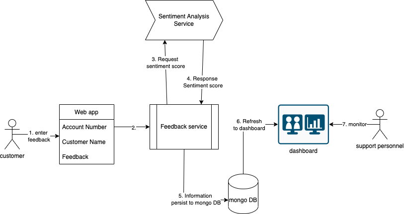

## Customer Feedback -> Sentiment Analysis -> Dashboard

### Architecture


### Build instruction
```bash
# run this so that minikube can use these images - without the need to push to docker repo.
eval $(minikube docker-env)

docker build ./feedback-service -t feedback-service -f feedback-service/Dockerfile
docker build ./sentiment-service -t sentiment-service -f sentiment-service/Dockerfile
docker build ./sentiment-dashboard -t sentiment-dashboard -f sentiment-dashboard/Dockerfile
docker build ./feedback-frontend -t feedback-frontend -f feedback-frontend/Dockerfile
```

### Running locally
```bash
# assuming minikube is installed
kubectl create -f feedback-sentiment-app-single-pod.yaml
# running tunnel into minikube
minikube tunnel --cleanup
```
